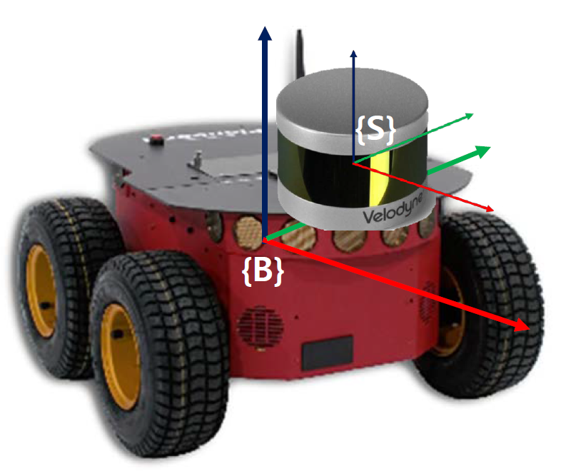
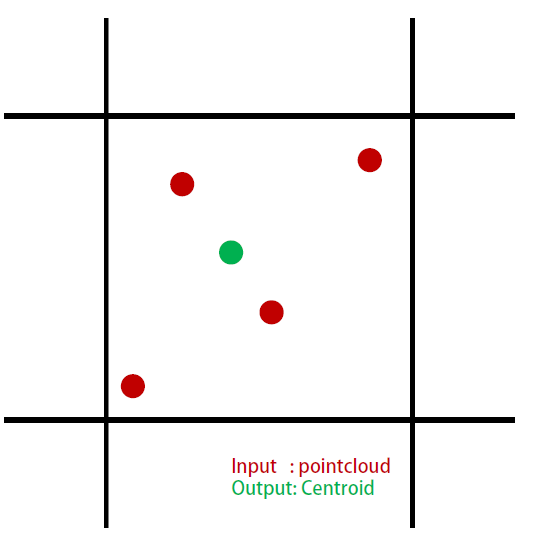
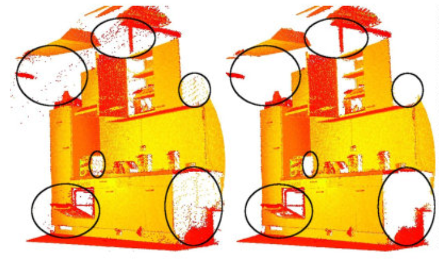

# PCL cheat sheet(2/2)

Original author: Hyungtae Lim (shapelim@kaist.ac.kr)

I really want to thank Seungwon and Hyungjin for their codes. <br/> 
Seungwon Song (sswan55@kaist.ac.kr) <br/>
Hyungjin Kim (hjkim86@kaist.ac.kr)

-----------

## Conversion

### sensor_msgs::PointCloud2 :arrow_right: pcl::PointCloud
```cpp
pcl::PointCloud<pcl::PointXYZ> cloudmsg2cloud(sensor_msgs::PointCloud2 cloudmsg)
  {
    pcl::PointCloud<pcl::PointXYZ> cloud_dst;
    pcl::fromROSMsg(cloudmsg, cloud_dst);
    return cloud_dst;
  }
```
### pcl::PointCloud :arrow_right: sensor_msgs::PointCloud2
```cpp
sensor_msgs::PointCloud2 cloud2cloudmsg(pcl::PointCloud<pcl::PointXYZ> cloud_src)
  {
    sensor_msgs::PointCloud2 cloudmsg;
    pcl::toROSMsg(cloudsrc, cloudmsg);
    cloudmsg.header.frame_id = "map";
    return cloudmsg;
  }
```

### sensor_msgs::LaserScan :arrow_right: sensor_msgs::PointCloud2
```cpp

#include "laser_geometry/laser_geometry.h"

sensor_msgs::PointCloud2 laser2cloudmsg(sensor_msgs::LaserScan laser)
    {
      static laser_geometry::LaserProjection projector;
      sensor_msgs::PointCloud2 pc2_dst;
      projector.projectLaser(laser, pc2_dst,-1,laser_geometry::channel_option::Intensity | laser_geometry::channel_option::Distance);
      pc2_dst.header.frame_id = "map";

      return pc2_dst;
    }
```

## Transformation


```cpp
//Input: pcl::PointCloud source, cloud_src
//Output: Transformed pcl::PointCloud, pc_transformed via 4x4 transformation matrix

pcl::PointCloud<pcl::PointXYZ> pc_transformed;
pcl::PointCloud<pcl::PointXYZ>::Ptr ptr_transformed(new pcl::PointCloud<pcl::PointXYZ>);

Eigen::Matrix4f trans;
trans<< 1,   0,  0, 0.165,
        0,   1,  0, 0.000,
        0,   0,  1, 0.320,
        0,   0,  0,     1;
pcl::transformPointCloud(cloud_src, *ptr_transformed, trans);

pc_transformed = *ptr_transformed
```

## Filtering using a PassThrough Filter

```cpp
#include <pcl/filters/passthrough.h>

//Input: pcl::PointCloud source, cloud_src
//Output: Filtered pcl::PointCloud, pc_filtered along z axis, from 0.5m to 100.0m

pcl::PointCloud<pcl::PointXYZ> pc_filtered;
pcl::PointCloud<pcl::PointXYZ>::Ptr ptr_filtered(new pcl::PointCloud<pcl::PointXYZ>);
pcl::PassThrough<pcl::PointXYZ> filter;

double min_range = 0.5;
double max_range = 100.0;
*ptr_filtered = cloud_src;

filter.setInputCloud(ptr_filtered);
filter.setFilterFieldName("z");
filter.setFilterLimits(min_range, max_range);
// filter.setFilterLimitsNegative(true);
filter.filter(*ptr_filtered);

pc_filtered = *ptr_filtered;
```


## Downsampling to a Voxel Grid

```cpp
#include <pcl/filters/voxel_grid.h>

//Input: pcl::PointCloud source, cloud_src
//Output: voxelized pcl::PointCloud, pc_voxelized 

pcl::PointCloud<pcl::PointXYZ> pc_voxelized;
pcl::PointCloud<pcl::PointXYZ>::Ptr ptr_filtered(new pcl::PointCloud<pcl::PointXYZ>);
pcl::VoxelGrid<pcl::PointXYZ> voxel_filter;

double var_voxelsize = 0.05;

*ptr_filtered = cloud_src;
voxel_filter.setInputCloud(ptr_filtered);
voxel_filter.setLeafSize(var_voxelsize, var_voxelsize, var_voxelsize);
voxel_filter.filter(*ptr_filtered);

pc_voxelized = *ptr_filtered;
```
그런데 굳이 filter()함수에 ptr을 넣지 않고 직접적으로 pcl::PointCloud<pcl::PointXYZ>로 받아도 된다.
```cpp
void mapgen::voxelize(pcl::PointCloud<pcl::PointXYZ>::Ptr pc_src, pcl::PointCloud<pcl::PointXYZ>& pc_dst, double var_voxel_size){

  static pcl::VoxelGrid<pcl::PointXYZ> voxel_filter;
  voxel_filter.setInputCloud(pc_src);
  voxel_filter.setLeafSize(var_voxel_size, var_voxel_size, var_voxel_size);
  voxel_filter.filter(pc_dst);

}
```

## Statistical Outlier Removal


The number of neighbors to analyze for each point is set to 10, and the standard deviation multiplier to 1.0
```cpp
#include <pcl/filters/statistical_outlier_removal.h>

//Input: pcl::PointCloud source, cloud_src
//Output: voxelized pcl::PointCloud, pc_sor_filtered 

pcl::PointCloud<pcl::PointXYZ> pc_sor_filtered;
pcl::PointCloud<pcl::PointXYZ>::Ptr ptr_sor_filtered(new pcl::PointCloud<pcl::PointXYZ>);
*ptr_sor_filtered = cloud_src;

int num_neigbor_points = 10;
double std_multiplier = 1.0;

pcl::StatisticalOutlierRemoval<pcl::PointXYZ> sor;
sor.setInputCloud (ptr_sor_filtered);
sor.setMeanK (num_neigbor_points);
sor.setStddevMulThresh (std_multiplier);
sor.filter(*ptr_sor_filtered);

pc_sor_filtered = *ptr_sor_filtered;
```

## Reference
[1] Using a matrix to transform a point cloud, http://pointclouds.org/documentation/tutorials/matrix_transform.php <br/>
[2] Filtering a PointCloud using a PassThrough filter, http://pointclouds.org/documentation/tutorials/passthrough.php <br/>
[3] Downsampling a PointCloud using a VoxelGrid filter, http://pointclouds.org/documentation/tutorials/voxel_grid.php <br/>
[4] Removing outliers using a StatisticalOutlierRemoval filter, http://pointclouds.org/documentation/tutorials/statistical_outlier.php <br/>


