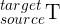

# graph slam tutorial

## Description of rosbag file

* Mode: 

WBU

자칼의 xyz가 이상함!!! 거꾸로 가는듯한 느낌이 있음

<pre><code>rosparam set use_sim_time true</code></pre>

<pre><code>rosbag play A4.bag --clock</code></pre>

<pre><code>roslaunch /home/shapelim/catkin_ws/src/ouster_example-master/ouster_ros/os1.launch replay:=true</code></pre>

leaf size is too small!!

-> 0.2 이상으로 키우면 된다.

icp:  , 즉 target의 관점에서 바라본 source가 계산됨
